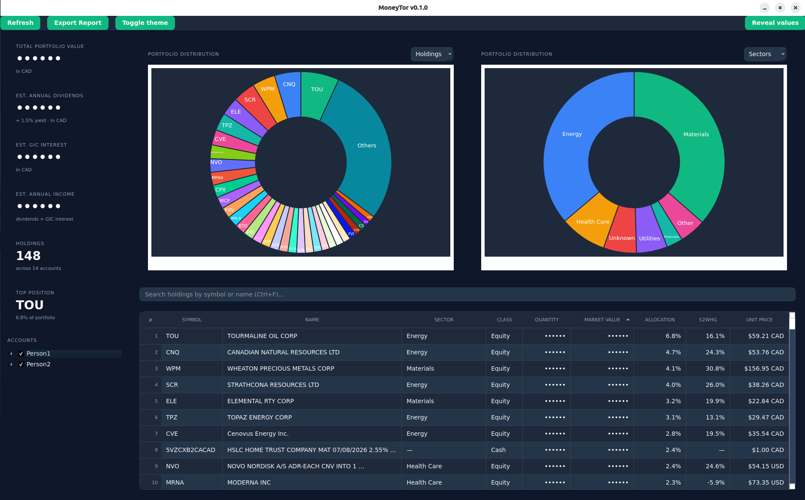

<p align="center">
  
</p>

# MoneyTor

Your family's whole portfolio on one screen.

MoneyTor connects to **Wealthsimple** and **Questrade**, merges everyone's
holdings into a single view, converts it all to one currency, and shows it on a
dashboard with charts and exportable reports.

- Runs entirely on your computer — it talks to your brokers and an exchange-rate
  API, and to no MoneyTor server, because there isn't one
- Multiple people, multiple accounts (TFSA, RRSP, Margin, GIC…)
- Merges the same stock held across different accounts and exchanges
- CAD ⇄ USD conversion, always with exact decimals
- PDF and Markdown reports
- Dark and light themes

> Developers: see [`DEVELOPERS_README.md`](./DEVELOPERS_README.md).

---

## The dashboard



| Area | What it shows |
| --- | --- |
| **KPI cards** (left) | Total value, annual dividends, GIC interest, income, holdings count, top position |
| **Charts** (center) | Two panels, each switching independently between holdings and sectors |
| **Holdings table** (bottom) | Every position merged across accounts, with allocation %, 52-week high distance, unit price |
| **Sidebar** (left) | Toggle people and accounts on and off |
| **⚙ Settings** (top right) | Theme, private mode, start at login, export |

### Why are the numbers hidden behind `••••••`?

That screenshot has **private mode** on — a privacy screen for when someone is
looking over your shoulder.

- Hides every dollar figure: total value, dividends, GIC interest, income, and each holding's shares and market value
- Leaves the safe context visible: allocation %, sectors, unit prices
- Turning it **on** is instant; turning it **off** needs your password

---

## Install

MoneyTor uses [**uv**](https://docs.astral.sh/uv/), which installs Python for
you. You don't need Python already.

```bash
curl -LsSf https://astral.sh/uv/install.sh | sh
```

<details>
<summary>Windows (PowerShell)</summary>

```powershell
powershell -ExecutionPolicy ByPass -c "irm https://astral.sh/uv/install.ps1 | iex"
```
</details>

Then:

```bash
git clone https://github.com/raminrasoulinezhad/MoneyTor.git moneytor
cd moneytor
uv sync
```

---

## Set up your accounts

Your credentials live in a `.env` file that never leaves your computer.

```bash
cp .env.example .env
```

Open `.env` and fill it in.

**App settings**

| Key | What it does |
| --- | --- |
| `MONEYTOR_DISPLAY_CURRENCY` | Currency everything is shown in — `CAD` or `USD` |
| `MONEYTOR_LOG_LEVEL` | How chatty the logs are — `INFO` is fine |
| `MONEYTOR_APP_PASSWORD` | Password asked on launch. Leave blank for no lock |

**Accounts** — one block per person. Replace `PERSON1` with a short name like
`RAMIN`. Add as many people as you like.

```dotenv
# Wealthsimple
MONEYTOR__PERSON1__WEALTHSIMPLE_EMAIL=you@example.com
MONEYTOR__PERSON1__WEALTHSIMPLE_PASSWORD=your-password

# Questrade — App Hub → Register a personal app → copy the refresh token
MONEYTOR__PERSON1__QUESTRADE_REFRESH_TOKEN=your-refresh-token
```

- A person can have Wealthsimple, Questrade, or both
- Wealthsimple may text you a 2FA code on first connection — MoneyTor will ask for it
- 🔒 **Never share `.env`.** It holds real passwords. It is already gitignored

No credentials? MoneyTor still opens, using a demo portfolio.

---

## Run

```bash
uv run python src/main.py
```

### Optional: a desktop icon (Linux)

```bash
./scripts/install-desktop.sh
```

Press **Super** and type "MoneyTor", or double-click the desktop icon. Remove it
later with `./scripts/install-desktop.sh --uninstall`.

Prefer MoneyTor to open by itself? Tick **Open MoneyTor when I log in** in
⚙ Settings — it works on Linux, macOS, and Windows, and unticking removes it.
The app still starts locked, so logging in doesn't expose your portfolio.

---

## Troubleshooting

| Problem | Fix |
| --- | --- |
| `command not found: uv` | Restart your terminal after installing uv |
| Login fails or asks for a code | Wealthsimple 2FA — enter the texted code when prompted |
| A person won't load | They need *either* a Questrade token *or* both a Wealthsimple email **and** password |
| Values won't unhide | Private mode needs `MONEYTOR_APP_PASSWORD` — the same one used on launch |

---

## License

[Apache License 2.0](LICENSE) · Copyright (c) 2026 Seyedramin Rasoulinezhad ·
see [NOTICE](NOTICE)
